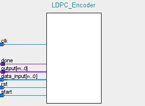
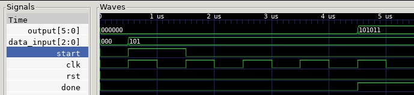
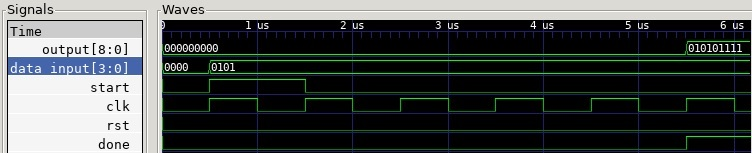

# HDL LDPC Encoder  
A customizable, nMigen-based LDPC Encoder IP Core.  

   
## Introduction  
Presented here is a customizable, nMigen-based LDPC Encoder IP Core.  
The core is located at src/ldpc_encoder.py.  
The IP Core was designed to be extremely flexible, fast and verifiable.  
In order to use this core, the top-level nMigen module which instantiates the core simply needs to provide the length of the LDPC codeword for a (k,n) LDPC code along with the appropriate generator matrix 'G' like so:

```python
    m = Module()

    generatorMatrix = [ [0b100101],
                        [0b010111],
                        [0b001110], ]

    #Instantiate the LDPC_Encoder Module with the generator matrix and output codeword size as parameters
    m.submodules.LDPC_Encoder = LDPC_Encoder = LDPC_Encoder(generatorMatrix,6)
```
Verilog or ILang code can then be generated from this top-level module.  
***

When the top-level module is built/generated, an HDL IP Core with 4 input ports and 2 output ports is produced.  
  
These ports are:  
**Input**  
clk - The clock input (width: 1)  
rst - The reset input (width: 1)  
data_input - The data to be encoded (width: n, where n = rows in generator matrix)  
start - The signal which initiates the encoding process  (width: 1)

**Output**  
done - A signal which is high only when encoding has been completed (width: 1)  
data_output - The encoded codeword  (width: m, where m = codeword size)  

***  
  
In order to demonstrate the power and flexibility of this design, two 'top level' example designs have been produced, both of which use the same ldpc_encoder implementation. These can be found in the root of the project with the names **ldpc_encoder_6_3_toplevel.py** and **ldpc_encoder_9_4_toplevel.py**. These 'top level' nMigen example modules employ (6,3) and (9,4) LDPC codes, respectively and demonstrate just how easy it is to use this LDPC Encoder with any (k,n) LDPC Code.  
  
In addition, each 'top level' example design also has an accompanying Verification project file and Simulation project file which demonstrate the correct operation of the LDPC Encoder implementation.
  
## **Environment Setup**  
  This section will outline the dependencies which are required to be installed in order to:  
  1) Build/Generate the design  
  2) Simulate the design  
  3) Verify the design  

### **Build/Generate Dependencies**  

nMigen:  
<https://nmigen.info/nmigen/latest/install.html>

Yosys, Yosys-SMTBMC and ABC:  
<https://symbiyosys.readthedocs.io/en/latest/quickstart.html#installing>
  
### **Simulation Dependencies**  

Gtkwave:  
```bash
apt install gtkwave
```

### **Verification Dependencies**  

SimbiYosys, Yices 2, Z3 and Boolector:  
<https://symbiyosys.readthedocs.io/en/latest/quickstart.html#installing>

## **Generate/Build Instructions**
After installing nMigen and Yosys, simply run:
```bash
python3 ldpc_encoder_6_3_toplevel.py generate -t v > ldpc_encoder_top.v
```
OR
```bash
python3 ldpc_encoder_9_4_toplevel.py generate -t v > ldpc_encoder_top.v
```
These commands will output the (6,3) or (9,4) LDPC Encoder module in Verilog format which can then be used in an FPGA or ASIC design.

## Simulation
```bash
python3 ldpc_encoder_6_3_sim.py #Run the simulation and generate the output waveform
gtkwave test_6_3.vcd #Open the output waveform
```
OR
```bash
python3 ldpc_encoder_9_4_sim.py #Run the simulation and generate the output waveform
gtkwave test_9_4.vcd #Open the output waveform
```

## Formal Verification
Formal verification is the process of using Assert, Assume and Cover statements to ensure that the design is fully compliant with any/all design constraints.
```bash
python3 ldpc_encoder_9_4_verification.py generate -t il > toplevel.il
sby -f ldpc_encoder.sby
```

## Results  
**(6,3) LDPC Encoder Code**  
Simulation:  
  
Formal Verification:
**PASSED**  
  
**(9,4) LDPC Encoder Code**  
Simulation:  
  
Formal Verification:
**PASSED** 
